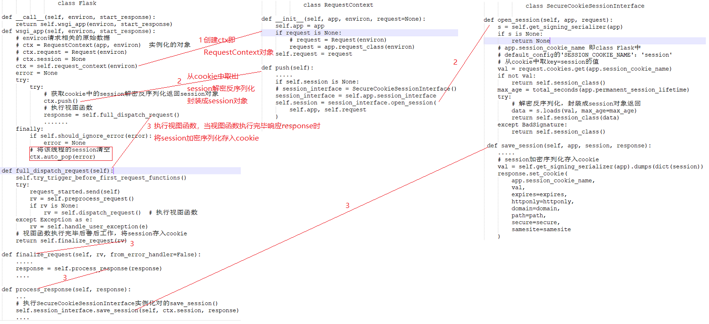

# flask总结
### 1. 给你一个路径 "settings.Foo"，可以找到类并获取去其中的大写的静态字段。
```
settings.py
    class Foo:
        DEBUG = True
        TEST = True
xx.py 
    import importlib

    path = "settings.Foo"

    p,c = path.rsplit('.',maxsplit=1)
    m = importlib.import_module(p)
    cls = getattr(m,c)

    # 如果找到这个类？
    for key in dir(cls):
        if key.isupper():
            print(key,getattr(cls,key))
```
### 2. flask的配置文件
```
settings.py
from datetime import timedelta


class Config(object):
    DEBUG = False
    TESTING = False
    SECRET_KEY = 'myflasksecretkey'  # 加密的盐
    PERMANENT_SESSION_LIFETIME = timedelta(days=7)  # session保存的天数


class ProductionConfig(Config):
    """
    生产时的配置信息
    """
    DEBUG = False


class DevelopmentConfig(Config):
    """
    开发时的配置信息
    """
    DEBUG = True


class TestingConfig(object):
    """
    测试时的配置信息
    """
    TESTING = True

hello.py中对配置文件的设置
app = Flask(__name__)
app.config.from_object('settings.DevelopmentConfig')
```
## 二. 路由系统 
### 1. endpoint 为路由指定名称
```
@app.route('/user/<int:id>', endpoint='one_user')
def get_one_user(id):
    pass
```
### 2. url_for() 反向生成路由
```
# 如果路由中没有指定endpoint那么默认是函数名
url_for('endpoint') / url_for("index",nid=777)
```
### 3. methods 
```
# 不指定methods默认是GET
from flask import request
@app.route('/index/<int:nid>',methods=['GET','POST'])
def index(nid):
    if request.method == 'POST':
        pass
    print(nid)
    return "Index"
```
## 三. FBV

## 四. 请求相关 
```
# 请求相关信息
# request.method
# request.args
# request.form
# request.values
# request.cookies
# request.headers
# request.path
# request.full_path
# request.script_root
# request.url
# request.base_url
# request.url_root
# request.host_url
# request.host
# request.files
# obj = request.files['the_file_name']
# obj.save('/var/www/uploads/' + secure_filename(f.filename))
```
## 五. 响应
### 1. 响应的内容
```
@app.route('/response_body')
def return_response_body():
    from flask import request, jsonify, render_template, url_for, make_response
    # 响应体
    # return 'hahah'  # 返回字符串
    # hh = jsonify(dict(name='dashuiage'))  # 返回json字符串,其实执行jsonify()返回一个response对象
    # hh = render_template('hy.html')  # 返回模板，其实是一个字符串，render_template()将模板转换成了字符串
    hh = redirect(url_for('hahah'))  # 重定向，redirect()返回一个response对象
    return hh
```
### 2. 设置响应头设置cookie
```
@app.route('/response_body')
def return_response_body():
    from flask import request, jsonify, render_template, url_for, make_response
    # 定制响应头
    response_obj = make_response(render_template('hy.html'))  # 参数str或response对象,或者不传。返回一个response对象，可以对其设置headers等等
    response_obj.headers['xxxx'] = 'hahahah'
    # 设置cookie
    response_obj.set_cookie('123', '123')
    return response_obj  # 返回response，如果不返回这个response那么之前对response的设置无效
```
## 六. 登陆验证
```
@app.route('/login', methods=['GET', 'POST'])
def login():
    from flask import render_template, request, url_for, session

    if request.method == 'POST':
        user_name = request.form.get('user', '')
        pwd = request.form.get('pwd', '')
        if user_name == '123' and pwd == '123':
            # 写入到session，然后加密后写入到cookie返回给浏览器如
            # cookie=session=eyJ1c2VyIjoiMTIzIn0.XEU5eg.DI3uLdKwuFT6YDz9lF8EzMPVSyk;....
            # 然后下次请时浏览器携带cookie到flask，flask解析cookie中的值，获取session然后解密封装成session对象
            session['user'] = user_name
            return redirect(url_for('huanying'))
    return render_template('login.html')

# 登陆验证原理：1、当用户发送账号密码进行登陆时，从数据库进行账号密码验证，账号密码错误返回登陆界面。
# 账号密码验证ok设置session，session['user'] = user
# 2、然后对session进行加密以key-value形式存入cookie，响应给浏览器
# 3、下次访问时请求中携带cookie，flask取出session那部分key-value进行解密，封装成session对象
# 4、对session.get('user', '')进行验证
# 登陆验证方式一
@app.route('/look_data')
def look_data():
    from flask import session, url_for, render_template
    user = session.get('user', '')
    if user:
        return render_template('login_after.html')
    return redirect(url_for('login'))

# 登陆验证方式二
import functools
from flask import session, redirect, url_for


def my_login_auth(func):
    @functools.wraps(func)  # 将inner函数名命名成func的名称
    def inner(*args, **kwargs):
        if not session.get('user', ''):
            return redirect(url_for('login'))
        return func(*args, **kwargs)
    return inner
    
    
@app.route('/look_data')
@my_login_auth
def look_data():
    from flask import render_template
    return render_template('login_after.html')


# 登陆验证方式三
from flask import request, redirect, url_for, session
@app.before_request
def my_login_auth():
    except_path = ['/login', '/favicon.ico', '/remove_cookie_session']
    if request.path in except_path:
        return None
    if not session.get('user'):
        return redirect(url_for('login'))
    return None


@app.route('/look_data')
def look_data():
    from flask import render_template
    return render_template('login_after.html')
```
## 七. 模板渲染
```
- 基本数据类型：可以执行python语法，如：dict.get()  list['xx']
- 传入函数
    - django，自动执行
    - flask，不自动执行
- 全局定义函数
    @app.template_global()
    def sb(a1, a2):
        # {{sb(1,9)}}
        return a1 + a2

    @app.template_filter()
    def db(a1, a2, a3):
        # {{ 1|db(2,3) }}
        return a1 + a2 + a3
- 模板继承
    layout.html
        <!DOCTYPE html>
        <html lang="zh-CN">
        <head>
            <meta charset="UTF-8">
            <title>Title</title>
            <meta name="viewport" content="width=device-width, initial-scale=1">
        </head>
        <body>
            <h1>模板</h1>
            
        </body>
        </html>
    
    tpl.html
        


        
            {{users.0}}
            

        	
- include 


    
    
    
    form.html 
        <form>
            asdfasdf
            asdfasdf
            asdf
            asdf
        </form>
- 宏
    
        <h1>宏</h1>
        <input type="{{ type }}" name="{{ name }}" value="{{ value }}">
        <input type="submit" value="提交">
    

    {{ ccccc('n1') }}

    {{ ccccc('n2') }}
    
- 安全
    - 前端： {{u|safe}}
    - 前端： MarkUp("asdf")
```
## 八. session
```
当请求刚到来：flask读取cookie中session对应的值：eyJrMiI6NDU2LCJ1c2VyIjoib2xkYm95，将该值解密并反序列化成字典，放入内存以便视图函数使用。
当请求结束时，flask会读取session中字典的值，进行序列化+加密，写入到用户cookie中。
from flask import session
@app.route('/ses')
def ses():
    session['k1'] = 123
    session['k2'] = 456
    del session['k1']
    return "Session"
```
## 九. flash
```
闪现，在session中存储一个数据，读取时通过pop将数据移除。
@app.route('/set_flash')
def set_flash():
    from flask import session, flash
    flash('12345678', 'myself')  # 其实是对session的操作
    flash('asdfg', 'myself')
    flash('zzzzz', 'hehe')
    return 'set flush'


@app.route('/get_from_flash')
def get_from_flash():
    """
    闪现，在session中存储一个数据，读取时通过pop将数据移除。
    :return:
    """
    from flask import session, flash, get_flashed_messages
    list_info = get_flashed_messages(category_filter=['myself', 'hehe'])
    return 'get from flash'
```
## 十. 中间件
```
- __call__方法什么时候出发？
- 用户发起请求时，才执行。
- flask的__call__方法执行了wsgi_app方法
from flask import Flask

app = Flask(__name__)
app.config.from_object('settings.DevelopmentConfig')


class MyMiddleware(object):
    """
    中间件
    :return:
    """
    def __init__(self, old):
        self.old = old

    def __call__(self, *args, **kwargs):
        # print('11111111111111111111')
        result = self.old(*args, **kwargs)
        # print('2222222222222222222')
        return result


@app.route('/index')
def index():
    return "Index"


if __name__ == '__main__':
    # 此处app.wsgi_app是一个地址作为参数传递，执行result = self.old(*args, **kwargs)时候
    # 其实是跳转到Flask类实例化的app对象中执行wsgi_app方法
    app.wsgi_app = MyMiddleware(app.wsgi_app)
    app.run()
```
## 十一. 特殊装饰器 
### 1. before_request和after_request
```
示例：
from flask import Flask
app = Flask(__name__)


@app.before_request
def x1():
    print('before:x1')
    return '滚'


@app.before_request
def xx1():
    print('before:xx1')


@app.after_request
def x2(response):
    print('after:x2')
    return response

@app.after_request
def xx2(response):
    print('after:xx2')
    return response


@app.route('/index')
def index():
    print('index')
    return "Index"


@app.route('/order')
def order():
    print('order')
    return "order"


if __name__ == '__main__':

    app.run()
# 结果：before_request先定义先执行，after_request后定义先执行。
# 当before_request有return时后面的before_request不执行
```
### 2. before_first_request
```
from flask import Flask
app = Flask(__name__)

@app.before_first_request
def x1():
    print('123123')


@app.route('/index')
def index():
    print('index')
    return "Index"


@app.route('/order')
def order():
    print('order')
    return "order"


if __name__ == '__main__':

    app.run()
    
# 结果：第一次请求过来时执行一次，后面的请求都不会执行
```
### 3. template_global和template_filter
应用在模板中被装饰的方法可以在模板中直接调用执行
### 4. errorhandler
```
@app.errorhandler(404)
def not_found(arg):
    print(arg)
    return "没找到"
```
## 十二. 什么是wsgi
```
web服务网关接口，wsgi是一个协议，实现该协议的模块：
- wsgiref Django
- werkzeug Flask
实现其协议的模块本质上就是socket服务端用于接收用户请求，并处理。
一般web框架基于wsgi实现，这样实现关注点分离。
```
### 1. wsgiref
```
from wsgiref.simple_server import make_server
 
def run_server(environ, start_response):
    start_response('200 OK', [('Content-Type', 'text/html')])
    return [bytes('<h1>Hello, web!</h1>', encoding='utf-8'), ]
 
 
if __name__ == '__main__':
    httpd = make_server('127.0.0.1', 8000, run_server)
    httpd.serve_forever()
```
### 2. werkzeug
```
from werkzeug.wrappers import Response
from werkzeug.serving import run_simple

def run_server(environ, start_response):
    response = Response('hello')
    return response(environ, start_response)

if __name__ == '__main__':
    run_simple('127.0.0.1', 8000, run_server)
```
### 3. Flask源码入口
```
from werkzeug.wrappers import Response
from werkzeug.serving import run_simple

class Flask(object):
    def __call__(self,environ, start_response):
        response = Response('hello')
        return response(environ, start_response)

    def run(self):
        run_simple('127.0.0.1', 8000, self)


app = Flask()

if __name__ == '__main__':
    app.run()
```
## 十三. 路由+视图
### 1. 路由设置的两种方式
```
# 第一种
@app.route('/xxx')
    def index():
        return "index"

# 第二种
def index():
    return "index"
app.add_url_rule("/xxx",None,index)

# 源码app.py下Flask类中的方法
def route(self, rule, **options):
    # route是一个装饰器，装饰视图函数，执行add_url_rule
    def decorator(f):
        endpoint = options.pop('endpoint', None)
        # rule=请求的url
        # endpoint=不指定时现在等于None，指定时等于指定的字符串
        # f=被装饰的视图函数
        self.add_url_rule(rule, endpoint, f, **options)
        return f
    return decorator
@setupmethod
def add_url_rule(self, rule, endpoint=None, view_func=None,
                 provide_automatic_options=None, **options):
    if endpoint is None:
        # view_func即传入的f
        # 执行_endpoint_from_view_func(view_func)时返回return view_func.__name__即返回方法名称
        # 复制给endpoint，所以当不指定endpoint时候默认是视图函数名
        endpoint = _endpoint_from_view_func(view_func)
    options['endpoint'] = endpoint
    methods = options.pop('methods', None)
    .....
    if view_func is not None:
    old_func = self.view_functions.get(endpoint)
    if old_func is not None and old_func != view_func:
        raise AssertionError('View function mapping is overwriting an '
                             'existing endpoint function: %s' % endpoint)
    # 将endpoint作为键view_func即视图函数作为值保存到view_functions这个字典中
    # 当两个视图函数endpoint相同函数名不同时就会抛异常
    self.view_functions[endpoint] = view_func

```
### 2. 路由传递的参数
```
@app.route和app.add_url_rule参数：
rule,                       URL规则
view_func,                  视图函数名称
defaults=None,              默认值,当URL中无参数，函数需要参数时，使用defaults={'k':'v'}为函数提供参数
endpoint=None,              名称，用于反向生成URL，即： url_for('名称')
methods=None,               允许的请求方式，如：["GET","POST"]

# 一般使用默认
strict_slashes=None,        对URL最后的 / 符号是否严格要求，
                            如：
                                @app.route('/index',strict_slashes=False)，
                                    访问 http://www.xx.com/index/ 或 http://www.xx.com/index均可
                                @app.route('/index',strict_slashes=True)
                                    仅访问 http://www.xx.com/index 
redirect_to=None,           重定向到指定地址
                            如：
                                @app.route('/index/<int:nid>', redirect_to='/home/<nid>')
                                或
                                def func(adapter, nid):
                                    return "/home/888"
                                @app.route('/index/<int:nid>', redirect_to=func)
# 很少使用
subdomain=None,             子域名访问
                                from flask import Flask, views, url_for

                                app = Flask(import_name=__name__)
                                app.config['SERVER_NAME'] = 'wupeiqi.com:5000'


                                @app.route("/", subdomain="admin")
                                def static_index():
                                    """Flask supports static subdomains
                                    This is available at static.your-domain.tld"""
                                    return "static.your-domain.tld"


                                @app.route("/dynamic", subdomain="<username>")
                                def username_index(username):
                                    """Dynamic subdomains are also supported
                                    Try going to user1.your-domain.tld/dynamic"""
                                    return username + ".your-domain.tld"


                                if __name__ == '__main__':
                                    app.run()
```
### 3. CBV
不常用在flask中一般使用FBV(视图函数)
```
import functools
from flask import Flask, views, url_for

app = Flask(__name__)
app.config.from_object('settings.DevelopmentConfig')


def wrapper(func):
    @functools.wraps(func)
    def inner(*args, **kwargs):
        print('1111111111111111111111')
        return func(*args, **kwargs)

    return inner


class UserView(views.MethodView):
    """
    CBV继承views.MethodView
    """
    # 指定请求方法
    methods = ['GET', 'POST']
    # 指定装饰器，为该类的每一个请求方法都装饰上
    decorators = [wrapper, ]

    def get(self, *args, **kwargs):
        return 'GET'

    def post(self, *args, **kwargs):
        return 'POST'


@app.route('/test_')
def test_():
    url_test = url_for('uuuu')
    return 'dsadasd'

# CBV 不能够使用装饰器来指定路由，第二个函数endpoint一般设置None也可以在as_view中指定
app.add_url_rule('/user', None, UserView.as_view('uuuu'))

if __name__ == '__main__':
    app.run()
```
### 4. 自定义正则
```
from flask import Flask, url_for

app = Flask(__name__)

# 步骤一：定制类
from werkzeug.routing import BaseConverter


class RegexConverter(BaseConverter):
    """
    自定义URL匹配正则表达式
    """

    def __init__(self, map, regex):
        super(RegexConverter, self).__init__(map)
        self.regex = regex

    def to_python(self, value):
        """
        路由匹配时，匹配成功后传递给视图函数中参数的值
        :param value:
        :return:
        """
        # 加了int指定返回int类型，不指定返回字符串
        return int(value)

    def to_url(self, value):
        """
        使用url_for反向生成URL时，传递的参数经过该方法处理，返回的值用于生成URL中的参数
        :param value:
        :return:
        """
        val = super(RegexConverter, self).to_url(value)
        return val


# 步骤二：添加到转换器
app.url_map.converters['reg'] = RegexConverter

"""
1. 用户发送请求
2. flask内部进行正则匹配
3. 调用to_python(正则匹配的结果)方法
4. to_python方法的返回值会交给视图函数的参数
"""


# 步骤三：使用自定义正则
@app.route('/index/<reg("\d+"):nid>')
def index(nid):
    print(nid, type(nid))

    print(url_for('index', nid=987))
    return "index"


if __name__ == '__main__':
    app.run()
```
## 十四. session实现原理

## 十五. 蓝图
- 给开发者提供目录结构
- 某一类url添加前缀
- 给一类url添加before_request
## 十六. threading.local
### 1. 作用
为每个线程创建一个独立的空间，使得线程对自己的空间中的数据进行操作（数据隔离）
```
import threading
from threading import local
import time

obj = local()

def task(i):
    obj.xxxxx = i
    time.sleep(2)
    print(obj.xxxxx,i)

for i in range(10):
    t = threading.Thread(target=task,args=(i,))
    t.start()
```
### 2. 获取一个线程的唯一标记threading.get_ident()
#### 2.1 根据字典自定义一个类似于threading.local功能
```
import time
import threading

DIC = {}

def task(i):
    ident = threading.get_ident()
    if ident in DIC:
        DIC[ident]['xxxxx'] = i
    else:
        DIC[ident] = {'xxxxx':i }
    time.sleep(2)

    print(DIC[ident]['xxxxx'],i)

for i in range(10):
    t = threading.Thread(target=task,args=(i,))
    t.start()
```
#### 2.2 根据字典自定义一个为每个协程开辟空间进行存取数据
```
import time
import threading
import greenlet

DIC = {}

def task(i):
    # ident = threading.get_ident()
    ident = greenlet.getcurrent()
    if ident in DIC:
        DIC[ident]['xxxxx'] = i
    else:
        DIC[ident] = {'xxxxx': i}
    time.sleep(2)

    print(DIC[ident]['xxxxx'], i)


for i in range(10):
    t = threading.Thread(target=task, args=(i,))
    t.start()
```
#### 2.3 通过getattr/setattr 构造出来 threading.local的加强版（协程）
```
import time
import threading

try:
    import greenlet

    get_ident = greenlet.getcurrent
except Exception as e:
    get_ident = threading.get_ident

class My_Local(object):
    DIC = {}

    def __getattr__(self, item):
        ident = get_ident()
        if ident in self.DIC:
            return self.DIC[ident].get(item)
        return None

    def __setattr__(self, key, value):
        ident = get_ident()
        if ident in self.DIC:
            self.DIC[ident][key] = value
        else:
            self.DIC[ident] = {key: value}

obj = My_Local()

def task(i):
    obj.xxxxx = i
    time.sleep(2)
    print(obj.xxxxx, i)


for i in range(10):
    t = threading.Thread(target=task, args=(i,))
    t.start()
```
## 十七. 上下文管理
```
请求到来时候：
    # ctx = RequestContext(self, environ) # self是app对象，environ请求相关的原始数据
    # ctx.request = Request(environ)
    # ctx.session = None
    
    # 将包含了request/session的ctx对象放到“空调”
        {
            1232：{ctx:ctx对象}
            1231：{ctx:ctx对象}
            1211：{ctx:ctx对象}
            1111：{ctx:ctx对象}
            1261：{ctx:ctx对象}
        }
        
视图函数：
    from flask import reuqest,session 
    
    request.method 
    
请求结束：
    根据当前线程的唯一标记，将“空调”上的数据移除。
```
## 十八. flask上下文知识点
### 1. 偏函数
```
import functools

def index(a1, a2):
    return a1 + a2

# 原来的调用方式
# ret = index(1,23)
# print(ret)

# 偏函数，帮助开发者自动传递参数
new_func = functools.partial(index, 666)
ret = new_func(1)
print(ret)
```
### 2. super和执行类的区别
```
class Base(object):

    def func(self):
        print('Base.func')


class Foo(Base):

    def func(self):
        # 方式一：根据__mro__的顺序执行方法
        # super(Foo,self).func()
        # 方式二：主动执行Base类的方法
        # Base.func(self)

        print('Foo.func')
```
### 2. 面向对象中特殊方法__setattr__/__getattr__注意事项
```
__setattr__注意事项：当在初始化时self.xxx = qqq和obj.xx = 123时会调用__setattr__
__getattr__注意事项：当在obj.xx时会调用__getattr__

class Foo(object):
    def __init__(self):
        # self.storage = {}
        # 调用父类object的__setattr__方法为storage设置值
        object.__setattr__(self,'storage',{})

    def __setattr__(self, key, value):
        print(key,value,self.storage)
        


obj = Foo()
obj.xx = 123
```
### 3. 基于列表实现栈(后进先出特征)
```
class MyStack(object):

    def __init__(self):
        self.data = []

    def push(self, val):
        self.data.append(val)

    def pop(self):
        return self.data.pop()

    def top(self):
        return self.data[-1]


my_stack = MyStack()
for i in range(10):
    my_stack.push(i)

my_stack.pop()
my_stack.pop()
```
## 十九. 上下文管理
### 1. Flask中Local和LocalStack的基本原理及request和session的基本实现
```
import functools
try:
    from greenlet import getcurrent as get_ident
except:
    from threading import get_ident

class Local(object):
    __slots__ = ('__storage__', '__ident_func__')

    def __init__(self):
        # __storage__ = {1231:{'stack':[]}}
        object.__setattr__(self, '__storage__', {})
        object.__setattr__(self, '__ident_func__', get_ident)

    def __getattr__(self, name):
        try:
            return self.__storage__[self.__ident_func__()][name]
        except KeyError:
            raise AttributeError(name)

    def __setattr__(self, name, value):
        # name=stack
        # value=[]
        ident = self.__ident_func__()
        storage = self.__storage__
        try:
            storage[ident][name] = value
        except KeyError:
            storage[ident] = {name: value}

    def __delattr__(self, name):
        try:
            del self.__storage__[self.__ident_func__()][name]
        except KeyError:
            raise AttributeError(name)


"""
__storage__ = {
    12312: {stack:[ctx(session/request) ,]}
}

"""

# obj = Local()
# obj.stack = []
# obj.stack.append('佳俊')
# obj.stack.append('咸鱼')
# print(obj.stack)
# print(obj.stack.pop())
# print(obj.stack)


class LocalStack(object):
    def __init__(self):
        self._local = Local()

    def push(self,value):
        rv = getattr(self._local, 'stack', None) # self._local.stack =>local.getattr
        if rv is None:
            self._local.stack = rv = [] #  self._local.stack =>local.setattr
        rv.append(value) # self._local.stack.append(666)
        return rv


    def pop(self):
        """Removes the topmost item from the stack, will return the
        old value or `None` if the stack was already empty.
        """
        stack = getattr(self._local, 'stack', None)
        if stack is None:
            return None
        elif len(stack) == 1:
            return stack[-1]
        else:
            return stack.pop()

    def top(self):
        try:
            return self._local.stack[-1]
        except (AttributeError, IndexError):
            return None


class RequestContext(object):
    def __init__(self):
        self.request = "xx"
        self.session = 'oo'


_request_ctx_stack = LocalStack()

_request_ctx_stack.push(RequestContext())


def _lookup_req_object(arg):

    ctx = _request_ctx_stack.top()

    return getattr(ctx,arg) # ctx.request / ctx.session
# 使用偏函数
request = functools.partial(_lookup_req_object,'request')
session = functools.partial(_lookup_req_object,'session')


print(request())
print(session())
```
### 2. 上下文管理之request实现
- 请求到来wsgi封装成environ(请求的原生数据)
- ctx = RequestContext(app, environ)创建请求上下文对象，同时设置ctx.request = Request(environ)
- ctx.push()
```
在globals.py中
_request_ctx_stack = LocalStack()
在RequestContext.push中，为当前线程开辟了存储空间{"线程标识符":{"stack":[ctx,]}},把ctx对象添加到local中
_request_ctx_stack.push(self)
```
### 3. 上下文管理之session实现
- 请求到来wsgi封装成environ(请求的原生数据)
- ctx = RequestContext(app, environ)创建请求上下文对象，同时设置ctx.request = Request(environ)
- ctx.push()
```
在globals.py中
_request_ctx_stack = LocalStack()
在RequestContext.push中，为当前线程开辟了存储空间{"线程标识符":{"stack":[ctx,]}},把ctx对象添加到local中
_request_ctx_stack.push(self)

if self.session is None:
    # session_interface = SecureCookieSessionInterface()
    session_interface = self.app.session_interface
    # 从cookie中获取session解密反序列化，封装成session对象返回
    self.session = session_interface.open_session(
        self.app, self.request
    )
```
- 执行视图函数response = self.full_dispatch_request()
```
ctx = _request_ctx_stack.top  # 从Local中取出当前ctx
.......
if not self.session_interface.is_null_session(ctx.session):
    # 执行SecureCookieSessionInterface实例化对的save_session()
    self.session_interface.save_session(self, ctx.session, response)
```
### 4. flask-session
```
import redis
from flask import Flask,request,session
from flask.sessions import SecureCookieSessionInterface
from flask_session import Session

app = Flask(__name__)

# app.session_interface = SecureCookieSessionInterface()
# app.session_interface = RedisSessionInterface()
app.config['SESSION_TYPE'] = 'redis'
app.config['SESSION_REDIS'] = redis.Redis(host='140.143.227.206',port=6379,password='1234')
Session(app)

@app.route('/login')
def login():
    session['user'] = 'alex'
    return 'asdfasfd'

@app.route('/home')
def index():
    print(session.get('user'))

    return '...'


if __name__ == '__main__':
    app.run()
```
- 原理
```
1. 将session数据保存到redis
    session:随机字符串1:q23asifaksdfkajsdfasdf
    session:随机字符串2:q23asifaksdfkajsdfasdf
    session:随机字符串3:q23asifaksdfkajsdfasdf
    session:随机字符串4:q23asifaksdfkajsdfasdf
    session:随机字符串5:q23asifaksdfkajsdfasdf
2. 随机字符串返回给用户。
3. 下次请求到来时携带这个随机字符串过来
源码：from flask_session import RedisSessionInterface
```


```
```